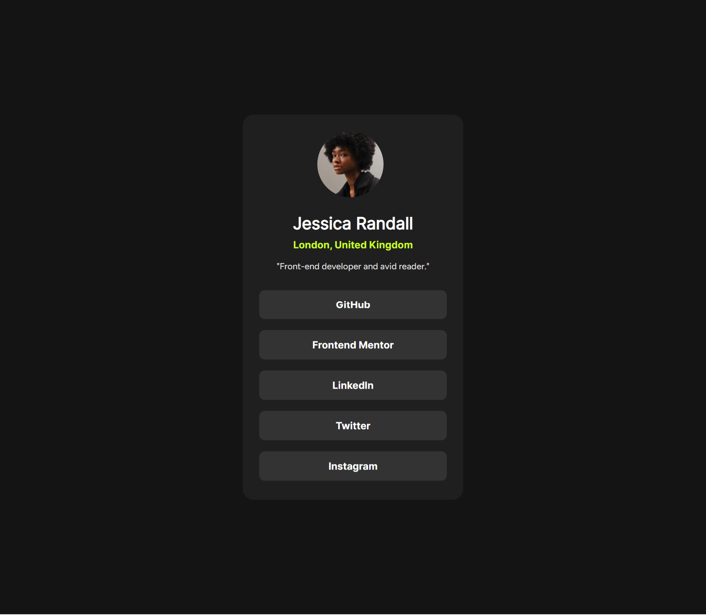

# Frontend Mentor - Social links profile solution

This is a solution to the [Social links profile challenge on Frontend Mentor](https://www.frontendmentor.io/challenges/social-links-profile-UG32l9m6dQ). Frontend Mentor challenges help you improve your coding skills by building realistic projects. 

## Table of contents

- [Overview](#overview)
  - [The challenge](#the-challenge)
  - [Screenshot](#screenshot)
  - [Links](#links)
- [My process](#my-process)
  - [Built with](#built-with)
  - [What I learned](#what-i-learned)
- [Author](#author)

## Overview

### The challenge

Users should be able to:

- See hover and focus states for all interactive elements on the page

### Screenshot

### Links

- Solution URL: [Solution URL](https://github.com/Abdul-Saidat/Social-links-profile)
- Live Site URL: [live site URL](https://social-links-profile-vert-eight.vercel.app/)

## My process

### Built with

- Semantic HTML5 markup
- CSS custom properties
- Flexbox
- Mobile-first workflow

### What I learned
I got to further understand where and how to apply the CSS margin property.

## Author
- Frontend Mentor - [@Abdul-Saidat](https://www.frontendmentor.io/profile/Abdul-Saidat)
- Twitter - [@Sahhyddahabdul](https://www.twitter.com/Sahhyddahabdul)

